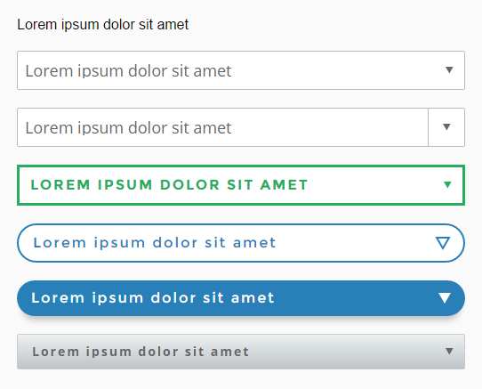

# Pure CSS select styling

CSS styling of select component without JS, and using inline SVGs for the arrow symbol. The idea is to get rid of the need of using JS / JQuery for a decent `select` styling. Using inline SVG files to avoid extra requests to the server and a good visualization quality in retina displays. The `select` component is thought to be **responsive by default**.

The base of the idea is to remove all the default styling on the select and use a wrapping `div` to add out custom styling.

## Usage
The easiest way of control your `<select>` size is using the `padding` property at `.theme-your-theme select` selector. Other customizations (font, size, color...) are made using standard CSS properties.

Please, take a look to the [**included demo**](https://htmlpreview.github.io/?https://github.com/carloscabo/pure-css-select-style/blob/master/index.html) for several samples.

## Browser support / tested in
Chome, Firefox, Edge, IE9+, Chrome for Android

SVG arrows made with:  
<https://github.com/carloscabo/svg-triangle-generator>
